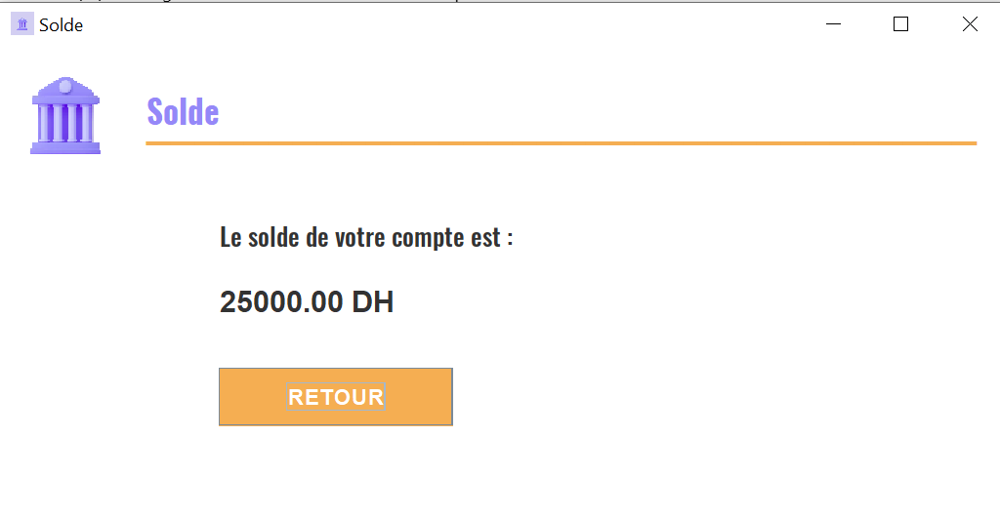

# Gestion Banque

<br/>
<p align="center">
  <a href="https://github.com/hamzaezzine/Gestion-Banque">
    
  </a>

  <h3 align="center">Gestion Banque</h3>

  <p align="center">
    Gestion Banque Java Swing Desktop Application
    <br/>
    <br/>
    <a href="https://github.com/hamzaezzine/Gestion-Banque/issues">Report Bug</a>
    .
    <a href="https://github.com/hamzaezzine/Gestion-Banque/issues">Request Feature</a>
  </p>
</p>


    

## Table Of Contents

- [Gestion Banque](#gestion-banque)
  - [Table Of Contents](#table-of-contents)
  - [About The Project](#about-the-project)
  - [Built With](#built-with)
  - [Getting Started](#getting-started)
    - [Prerequisites](#prerequisites)
    - [Installation](#installation)
  - [Conception](#conception)
  - [Screenshots](#screenshots)


## About The Project

The **Gestion Banque** project is a Java Swing Desktop Application designed to manage banking operations efficiently. With a user-friendly interface, it provides essential functionalities for users. The application allows users to perform various banking tasks, including account management, deposits, withdrawals, transfers, and more.

Key Features :

- **User Authentication:** Secure login and sign-up functionalities to ensure data privacy.
- **Account Operations:** Perform deposit, withdrawal, and transfer operations seamlessly.
- **Client Information:** View and update client details for accurate records.
- **Database Integration:** Utilizes MySQL for robust and organized data storage.
- **Intuitive GUI:** Built with Java Swing, providing an intuitive and responsive graphical user interface.
- **...**


## Built With

- Java
- Swing
- MySQL


## Getting Started

To get started with the Hospital Management System, follow the instructions below.

### Prerequisites

Make sure you have the following prerequisites installed on your machine:

- Java Development Kit (JDK)
- XAMPP


### Installation

1. Clone the repository to your local machine:

```bash
   git clone https://github.com/hamzaezzine/Gestion-Banque.git
```

2. Create new database named **gestion_bank**  

3. Import Database from **database/gestion_bank_sql_script_final** to **phpmyadmin**

4. Import project to java IDE (Apache NetBeans 19 IDE)

5. Run `main.java`

## Conception

1. Database Schema


2. Class Diagram : 


3. Use Case Diagram : 


## Screenshots 

- Login : 


- Sign up : 


- Home : 


- Retrait : 


- Depot : 


- Transfert : 


- Solde : 


- Compte : 


- Update Client : 


- Update Compte : 

